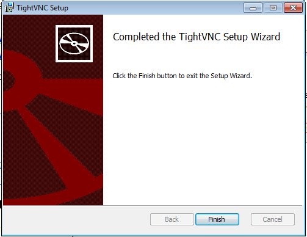
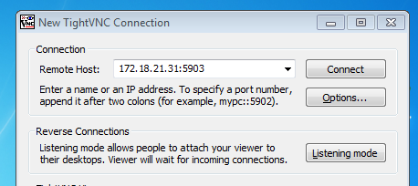

# u5-a3: Acceso remoto VNC

En esta actividad vamos a probar el acceso remoto mediante VNC, lo que nos permitirá acceder a los escritorios gráficos de los diferentes sistemas a los que tengamos acceso de forma remota. Para esta actividad necesitaremos 4 MVs:

* 2 MVs con Windows 7 (Cliente y Servidor)

* 2 MVs con OpenSUSE Leap (Cliente y Servidor)

## 1. Instalación VNC

Ahora pasaremos a instalar tanto los clientes como los servidores en los equipos.

### 1.1 Windows 7

Para las máquinas en Windows utilizaremos la herramienta *"tightVNC"*, que es un programa que permite esta funcionalidad de código libre. A la hora de descargar el programa solo hay una versión y desde los ajustes de la instalación podemos decidir si queremos instalar el cliente o el servidor.

Podemos descargar el programa desde su página oficial:  https://www.tightvnc.com/download.php

#### 1.1.1 Windows Servidor

A la Hora de instalar el programa en Windows como servidor podemos utilizar la instalación típica, con esta nos instalara el cliente y el servidor.

Mientras avanza el asistente nos ofrece introducir una contraseña para acceder desde el cliente, así como una contraseña para administrar el servidor.

Tras esto la herramienta ya quedara instalada en nuestro equipo.

#### 1.1.2 Windows Cliente

Esta instalación es idéntica a la otra, salvo que a la hora de elegir el tipo de instalación seleccionaremos "Custom". Donde elegiremos no instalar *"TightVNC Server"*.

### 1.2 OpenSUSE

En OpenSUSE podemos utilizar una herramienta que viene preinstalada.

#### 1.2.1 OpenSUSE Servidor

Para habilitar la herramienta desde el servidor debemos acceder a "Yast" -> "VNC", desde ahí activaremos el servidor VNC.

Descargara algunas dependencias desde los repositorios.

Además de Yast, también podemos gestionar este servidor con el comando *"vncserver"*.

Desde aqui podemos crear sesiónes independientes para cada usuario, en la captura podemos apreciar que se ha creado la sesión "3".

#### 1.2.2 OpenSUSE Cliente

En el cliente la aplicación *vncviewer* viene instalada por defecto en el sistema. No lo encontramos en la interfaz gráfica, por lo que tendremos que ejecutarlos desde comandos utilizando *"vncviewer"*.

## 2. Conexiones remotas desde las otras máquinas

Una vez realizadas las instalaciones y configuraciones pertinentes probaremos la conexión remota. Empecemos con OpenSUSE.

### 2.1 OpenSUSE Servidor -> OpenSUSE Cliente

Antes ya creamos la sesión "3" dentro del servidor de OpenSUSE, ahora desde nuestra máquina cliente tendremos que ejecutar el comando *vncviewer* e introducir la IP de nuestro servidor.

> Al ser la sesión "3", el puerto de entrada es el 5903. Dependiendo de la sesión cambiara el puerto, por ejemplo "n", tendrá el puerto 590n.

En esta última captura podemos ver la conexión remota de manera gráfica, también podemos verificar la conexion a través de comandos introduciendo "netstat -ntap" en la terminal.

### 2.2 Windows Servidor -> Windows Cliente

Para acceder al Servidor desde el cliente, al este venir ya configurado de serie, únicamente hay que ejecutar el programa tightVNC viewer.

Desde aquí nos pedirá que introduzcamos la IP del servidor, cuyo puerto por defecto es el "5900". En el caso de haberle puesto una contraseña también nos pedirá esta si se logra establecer la conexión.

Al igual que con OpenSUSE podemos utilizar el comando "netstat" para comprobar la conexión vía terminal, en este caso lo utilizaremos con el parámetro "-n".

### 2.3 Windows Servidor -> OpenSUSE Cliente

Esta vez vamos a probar mezclar sistemas operativos, como el protocolo que utilizan es el mismo no debería haber ningún problema. Primero intentemos acceder al Windows servidor desde el cliente con OpenSUSE.

Para ello utilizaremos nuevamente *"vncviewer"*.

Podemos comprobar que la conexión se ha establecido satisfactoriamente.

### 2.4 OpenSUSE Servidor -> Windows Cliente

Al igual que con el apartado anterior también es posible conectar los sistemas de forma inversa, aunque esta vez si tendremos que especificar el puerto de nuestro servidor OpenSUSE, que será el *"5903"*.

Habiendo comprobado que las conexiones son posibles entre todos con todos podemos dar por concluida esta actividad.
