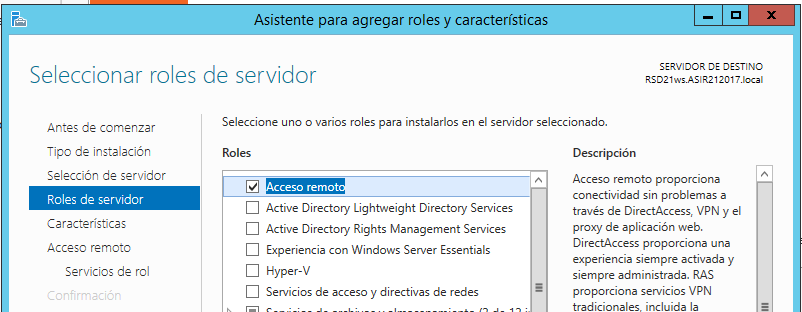

# U4-A6 | VPN en Windows 2012 Server

En esta actividad vamos a crear una máquina virtual con Windows 2012 server, la cual dispondra de dos insterfaces, una interna y otra externa. Esta máquina servirá como VPN.

# 1. Configuración de las interfaces

Con nuestra máquina con WS 2012 ya instalada vamos a configurar una interfaz en virtualbox con red interna y otra con adaptador puente para la red externa.

- Red Externa:

  

- Red Interna:

  

Ya dentro del sistema operativo vamos a indicar cual es la interna y cual es la externa fijándonos un sus MAC.

## 1.2 Configuración Interfaz Externa

Configuramos la interfaz externa de modo que solo dejamos habilitado TCP/IP v4.

Dentro de la configuración avanzada de TCP/IPv4 nos vamos a las pestaña `WINS` y deshabilitamos las dos opciones marcadas en la siguiente captura.

## 1.2 Configuración Interfaz Interna

En la interfaz interna solo vamos a configurar una IP para tener localizada la puerta de enlace desde las máquinas clientes.

# 2. Configuración del acceso remoto

Nos dirigimos al `Administrador del servidor` y agregamos un nuevo rol, en este caso será el rol de `Acceso Remoto`.

Este rol lo seleccionamos exclusivamente para poder seleccionar la opción `DirectAccess y VPN (RAS)`.

Terminamos la instalación del rol con las opciones por defecto. Una vez acabada nos indica que debemos configurarlo, por lo que clicamos el enlace.

En este apartado se nos indicará si queremos activar ambos servicios de acceso remoto, a nosotros solo nos interesa el acceso VPN.

## 2.1. Configuración de Enrutamiento y acceso remoto para VPN

Vamos a configurar ahora el servicio VPN. Pulsamos clic derecho en nuestro servidor y escogemos la primera opción.

Esto nos mandará a un asistente. Vamos a seleccionar las siguientes opciones:

- Seleccionamos el VPN.

- Seleccionamos la interfaz por la que salimos a internet.

Al clicar en finalizar podemos comprobar que ya esta activo el servicio.

### 2.1.1. Configurar filtros

En el caso de que queramos configurar filtros podemos dirigirnos a `IPv4` -> `Externa` y pulsamos sobre propiedades.

Desde hay pulsamos `Filtros entrantes...` y ya podemos configurar lo que queramos.

# 3. Configuración del cliente.

Vamos a configurar la interfaz como adaptador puente.

Configuramos la IP, le colocamos la siguiente respecto a nuestro servidor.

## 3.1. Configuración del VPN

Nos dirigimos al centro de redes y recursos y seleccionamos `Configurar una nueva conexión de red`.

- Seleccionamos conectar a una Red de trabajo.

  

- Seleccionamos `VPN`.

  

> En el siguiente paso nos pedirán un usuario y contraseña, al menos si utilizamos Wndows 7. Por lo que vamos a tener que configurar un usuario de active directory en nuestro servidor.
>
>
>
>En las propiedades de este usuario debemos ir al apartado `Marcado` y permitir las conexiones desde redes externas.
>
>
>
>Ya podremos iniciar sesión.
>
>

Esperamos a que inicie sesión y nos indica que estamos conectados.

# 4. Comprobaciones de la conexión

Si nos dirigimos a la ubicación de los ajustes de red podemos comprobar que estamos conectados a la red `VPN`.

Ejecutando `ipconfig` desde un `cmd` podemos comprobar que la IP que se nos ha asignado pertenece al rango establecido.

Una vez hecho estas comprobaciones podemos dar por finalizada la práctica.
