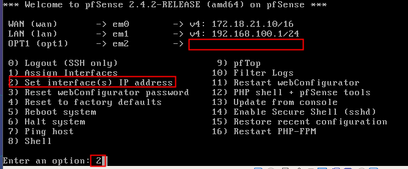

# U6-A1 | Balanceo de cargas con PfSense

En esta actividad vamos configurar una máquina con PfSense para que actúe como un balanceador de cargas de dos redes con acceso a internet. En este práctica usaremos:

- Una MV con PfSense.
- Una MV con Windows 7 que actuará como cliente.

# 1. Configuración PfSense

## 1.1. Interfaces

Vamos a configurar nuestra máquina con `Pfsense` con tres interfaces de red.

- La primera será un enlace a la red externa.

  

- La segunda interfaz sera un enlace a nuestra red interna, donde estará nuestro equipo con Windows 7.

  

- En la tercera interfaz vamos a simular una segunda salida a internet, aunque en este caso como no disponemos de tal se quedará apuntando a una red inexistente.

  

> En el caso de nuestra máquina con Windows 7 colocaremos su interfaz en modo interno, para que se comunique con la interfaz 2.
>
> 

## 1.2. Configuración de Red

En la práctica anterior con `pfsense` ya configuramos nuestras máquinas para utilizar 2 interfaces, por lo que en esta actividad solo tenemos que configurar una nueva interfaz.

- Seleccionamos la WAN1 y nuestra LAN.

  

- En la nueva interfaz le colocamos una IP cualquiera (en mi caso `192.168.103.1`), una máscara de red, y como debe simular una WAN, colocaremos también una puerta de entrada, por ejemplo en la misma IP.

  

  

  Hecho esto ya tendremos las 3 interfaces configuradas.

  

>Este sería el esquema a realizar en la actividad.
>
> 

# 2. Acceder desde el cliente al configurador Web

Primero otorgamos a nuestro equipo una IP perteneciente a la LAN de `pfsense`.

>Podemos comprobar que con esta IP tenemos ya acceso a internet.
>
>

Ahora vamos a logearnos en el configurador web.

# 3. Configurar interfaces para habilitar el balanceo de cargas

Bien, ahora solo nos falta configurar el balanceo de cargas o habilitar la alta disponibilidad en ambas interfaces que se encargan de las redes externas.

- Vamos a acceder a `system -> Routing`

  

> **Nota:** En este apartado nos encontraremos un problema, y es que aunque nuestra interfaz secundaria es detectada como WAN no se nos informa como tal, sino como OPT1.
>
>
>
>Al intentar cambiar de OPT1 a WAN nos mostrará un error por que el gateway de la interfaz es invalido.
>
>

Desde `System -> Routing` vamos a acceder al menú `Gateway Groups`. Este apartado es un menú donde podemos agrupar los Gateways que queramos para así convertirlos en un balanceador de cargas.

En nuestro caso vamos a especificar nuestras dos interfaces, en ellas vamos a especificar unos rangos de prioridad, donde seleccionaremos la interfaz real como `tier 1` y la interfaz que realmente no existe como `tier 2`, para que así la interfaz que existe tenga prioridad sobre la que no.

> **Nota:** En la captura no se muestra el nombre final, no permitía caracteres tan largos y el grupo se acabo llamando `balanceo`.

- Aplicamos cambios.

  

## 3.1. Configurar el gateway predeterminado de nuestra LAN

Ya tenemos creado nuestro sistema de alta disponibilidad, pero ahora debemos especificar que nuestra LAN utilice esta coni Gateway. Para ello nos dirigimos al menú `Firewall -> Rules`.

Desde este menú vamos a dirigirnos al apartado `LAN`, y editaremos la LAN que utiliza el protocolo IPv4, que es él que tenemos configurado en nuestro sistema.

Desde el menú emergente debemos desplegar los ajustes avanzados, donde buscaremos y modificaremos el apartado `Gateway`. En este apartado saldrán todos los gateways existente en nuestro sistema, así como los grupos de gateways. Seleccionamos nuestro grupo `balanceo` y le damos a guardar.

# 4. Comprobaciones

Al tener solo una interfaz hacia internet real nuestro equipo siempre debería salir por el gateway 1 (`172.18.0.1`). Haciendo uso del comando `Tracert` podemos comprobar que esto se cumple.

> En las capturas podemos ver como primero sale por la red interna, haciendo uso de la máquina pfsense, después pasa por el proceso de selección de interfaces, pero como solo funciona la interfaz de la WAN1, en ambas pruebas sale por la misma interfaz. En caso de tener varias redes reales esto sucedería de otra forma.

Una vez realizado esto podemos dar por finalizada la actividad.
